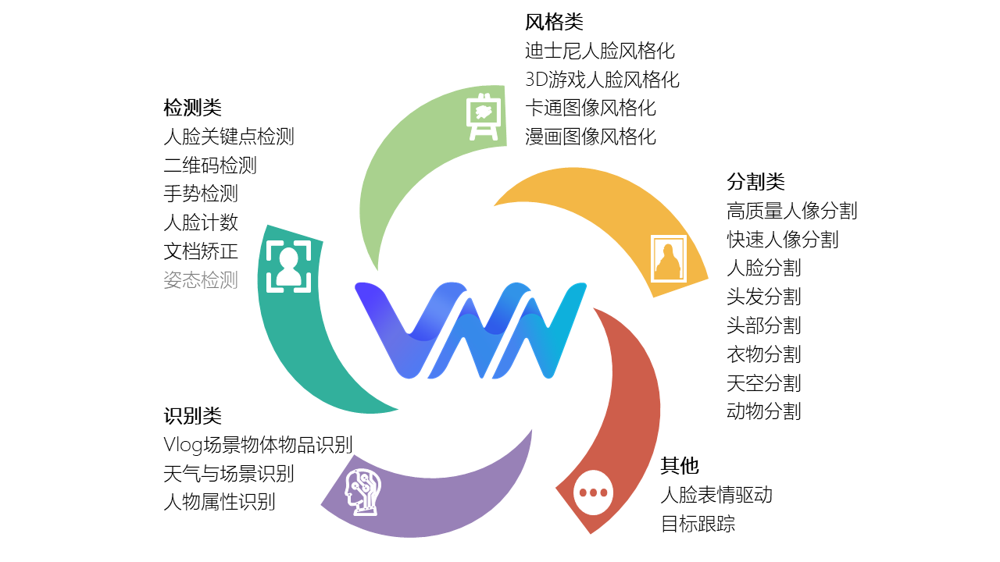
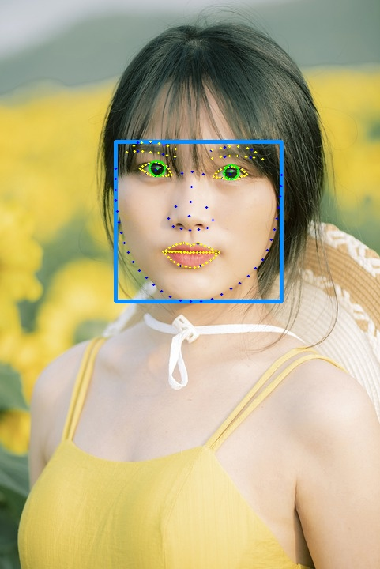
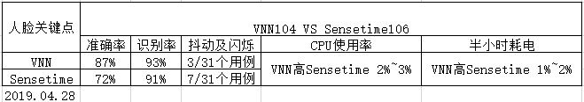
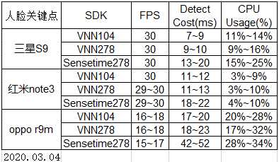

# 简介
VNN是由[欢聚集团(Joyy Inc.)](http://www.huanju.cn/)推出的高性能、轻量级神经网络部署框架。目前已为[Hago](https://www.ihago.net/)、[VOO](https://vooedit.com/)、[VflyCloud](https://cloud.vflyapp.com/desktop)、[Vfly](https://api-web.vflyapp.com/)、[马克水印相机](https://www.markiapp.com/)等App提供20余种AI能力的支持，覆盖直播、短视频、视频编辑等泛娱乐场景和工程场景

**特性**
- 免费：无授权控制，无广告植入
- 安全：零权限需求
- 跨平台一致设计和体验：良好支持Andorid/iOS系统平台, 即将支持Windows/MacOS/Linux系统平台
- 轻盈：全部功能SDK打包体积 Andorid 2.3M(arm64), iOS 2.0M(arm64)
- 易用：API风格简洁、统一

---

# 支持能力

---

## 人脸关键点
 || || |
 | :----------------------------: | :--------------------------------: | :---------------------------: | :-----------------: |
 | 原图 | [人脸关键点](./doc/face_landmark_dtection.md)  | 美颜 | 动态效果 |

### 指标对比
  
---

# 各功能效果展示

 

 |  |  |          |
 | :--------------------------------------------------: | :--------------------------------------------------: | :--------------------------------------------------------: |
 |  [迪士尼人脸风格化](./doc/disney_face_stylizing.md)  | [3D游戏人脸风格化](./doc/3d_game_face_stylizing.md)  | [油画图像风格化](./doc/cartoonstylizing_comicstylizing.md) |

 |  |  |  |
 | :----------------------------------------------------------------------: | :------------------------------------------------------------------: | :------------------------------------------------------------: |
 |                [人像分割](./doc/general_segmentation.md)                 |              [动物分割](./doc/general_segmentation.md)               |           [天空分割](./doc/general_segmentation.md)            |

  |  |  |  |
  | :--------------------------------------------------------------------: | :----------------------------------------------------------------: | :----------------------------------------------------------------------: |
  |               [衣物分割（换色）](./doc/general_segmentation.md)                |             [头发分割（换色）](./doc/general_segmentation.md)              |                  [人脸表情驱动](./doc/face_reenactment.md)                   |

---

## Demo体验

[Android Demo APK](./demos/Android/vnn_demo.apk)  
[Android Demo工程](./demos/Android)  
[iOS Demo工程](./demos/iOS)  

---

## 集成指引与SDK文档

[Android集成指引](./demos/Android/readme.md)  
[iOS集成指引](./demos/iOS/readme.md)  
[SDK文档索引](./doc/doc_index.md)   
[常见问题](./doc/question_and_answer.md)

---

## 更新计划
- 2021.12.15 支持 Windows/MacOS 平台
- 2021.12.30 支持 Linux 平台
- 2022.01.15 新增人体关键点检测（Pose Detection）SDK
- 发布模型转换工具链以及模型调用接口
- 发布libs核心源代码

---
## License

[MIT](./license.txt)

---
## 注明
如果有商用或使用问题可以随时联系我们：  
edenworm@gmail.com, yong1514@gmail.com, fengwu092@gmail.com, ningpeiyang@joyy.com