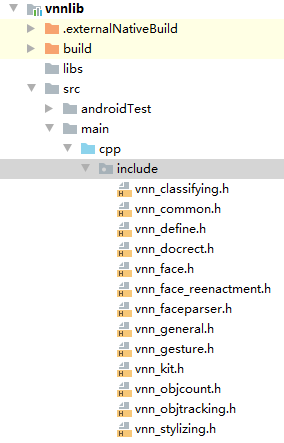
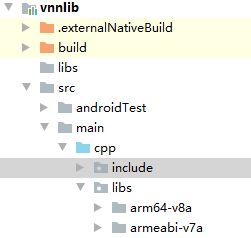
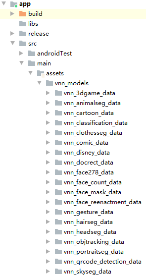

- [1. Android apk](#1-android-apk)
- [2. Android工程](#2-android工程)
  - [1. 头文件](#1-头文件)
  - [2. 库文件](#2-库文件)
  - [3. 模型文件](#3-模型文件)
  - [4. 编译Android工程生成apk即可](#4-编译android工程生成apk即可)
  - [5. 其它](#5-其它)
    - [(1) 横竖屏问题：Demo目前只支持竖屏显示效果。](#1-横竖屏问题demo目前只支持竖屏显示效果)
  
# 1. Android apk
可直接在Android手机上安装使用
[APK下载链接](./vnn_demo.apk)
# 2. Android工程
## 1. 头文件
拷贝根目录下 ```libs/headers``` 文件夹中的头文件放入```vnn_android_demo/vnnlib/src/main/cpp/include``` 文件夹中  

## 2. 库文件
拷贝根目录下 ```libs/Android``` 文件夹下内容放入 ```vnn_android_demo/vnnlib/src/main/cpp/libs``` 文件夹中  

## 3. 模型文件
拷贝根目录下models文件夹中的内容放入 ```vnn_android_demo/app/src/main/assets/vnn_models``` 文件夹中  

## 4. 编译Android工程生成apk即可
如果对assets中的内容做改动，需要先卸载已经安装的vnn的apk, 再重新安装(因为demo未对assets内容二进制校验，只校验了文件夹, 新添加的文件夹会自动拷贝到手机上)  
## 5. 其它
### (1) 横竖屏问题：Demo目前只支持竖屏显示效果，横屏未对结果做相应的渲染适配。
### (2) 涉及到多个人脸的，与分割有关的，如头部分割，3d game风格等，会产生多个mask。 demo只是简单的将所有的mask画到同一张图上，再做后续处理，因为mask的重叠问题，可能会引起效果上的显示问题，实际使用时应该每个mask都单独做后续处理。
