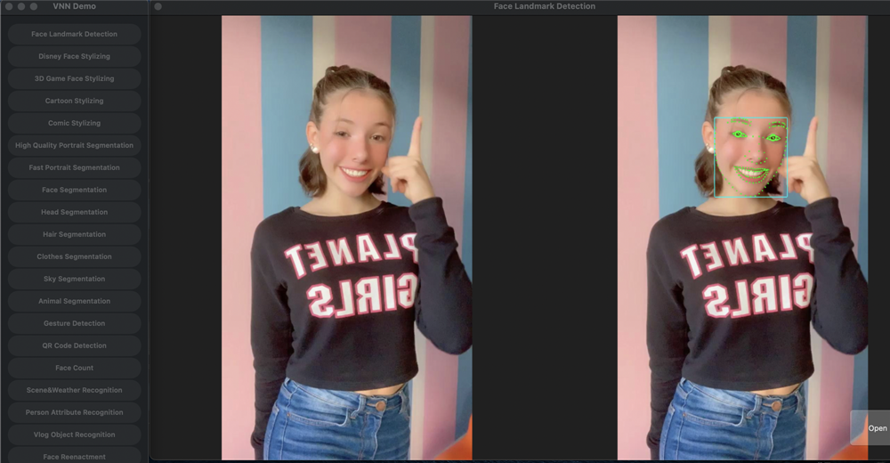
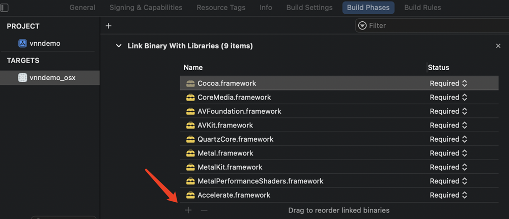

- [1. MacOS Demo安装包](#1-macos-demo安装包)
- [2. 运行MacOS Demo工程](#2-运行macos-demo工程)
  - [1. 解压Framework](#1-解压framework)
  - [2. 拷贝头文件与库文件](#2-拷贝头文件与库文件)
  - [3. 拷贝模型文件](#3-拷贝模型文件)
  - [4. 检查集成情况](#4-检查集成情况)
  - [5. 运行](#5-运行)
- [3. VNN SDK集成参考](#3-vnn-sdk集成参考)
  - [1. 添加系统库依赖](#1-添加系统库依赖)
  - [2. 添加VNN库](#2-添加vnn库)
  - [3. 添加头文件搜索路径](#3-添加头文件搜索路径)
  - [4. 设置安装时拷贝Framework](#4-设置安装时拷贝framework)
  - [5. 放置模型文件、运行等](#5-放置模型文件运行等)

# 1. MacOS Demo安装包
因Apple签名机制的限制，暂不能提供dmg安装包体验，需要通过Demo工程生成安装包

# 2. 运行MacOS Demo工程
MacOS Demo工程已提前预设Framework路径、头文件搜索路径等，按如下操作即可运行      
需要准备XCode（指引使用版本为版本为13.1），运行MacOS（版本10.10及以上）的计算机（Intel x64 CPU 和 Apple arm64 CPU均可）   
## 1. 解压Framework
进入```libs/macOS```目录，就地解压```x86_64_arm64.zip```文件
## 2. 拷贝头文件与库文件
拷贝根目录下的 ```libs``` 文件夹，放入 ```vnn_macos_demos``` 文件夹中  
## 3. 拷贝模型文件
拷贝根目录下的 ```models``` 文件夹中的内容放入 ```vnn_mac_demos/files``` 文件夹中  
## 4. 检查集成情况
用 XCode 打开 vnn_macos_demos 目录下的 ```vnndemo.xcodeproj```文件，如上述步骤正确，XCode将显示 ```Framework``` 集成情况如下   

    

```models``` 集成情况如下   


## 5. 运行
VNN MacOS 提供摄像头和相册两种演示模式，以下分别为手势识别SDK的摄像头Demo、人脸关键点检测SDK的相册Demo   
   

  

点击Archive可生成ipa安装包用于分发测试，这里不展开说明   

   

# 3. VNN SDK集成参考
## 1. 添加系统库依赖
VNN Demo 依赖9个系统库，按如下图添加这些依赖库   

   

## 2. 添加VNN库
参考文档页面，根据需要的功能按需添加VNN库的framework。在Demo添加了全部的VNN framework   

   
   


## 3. 添加头文件搜索路径
   

## 4. 设置安装时拷贝Framework
在 ```Build Settings```  选项卡下点击“+”，选择```“New Copy Flies Phase”```   

   

将第2步添加的framework，添加到安装时拷贝的文件列表中   

   

## 5. 放置模型文件、运行等
参考上文 ```运行MacOS Demo工程```
