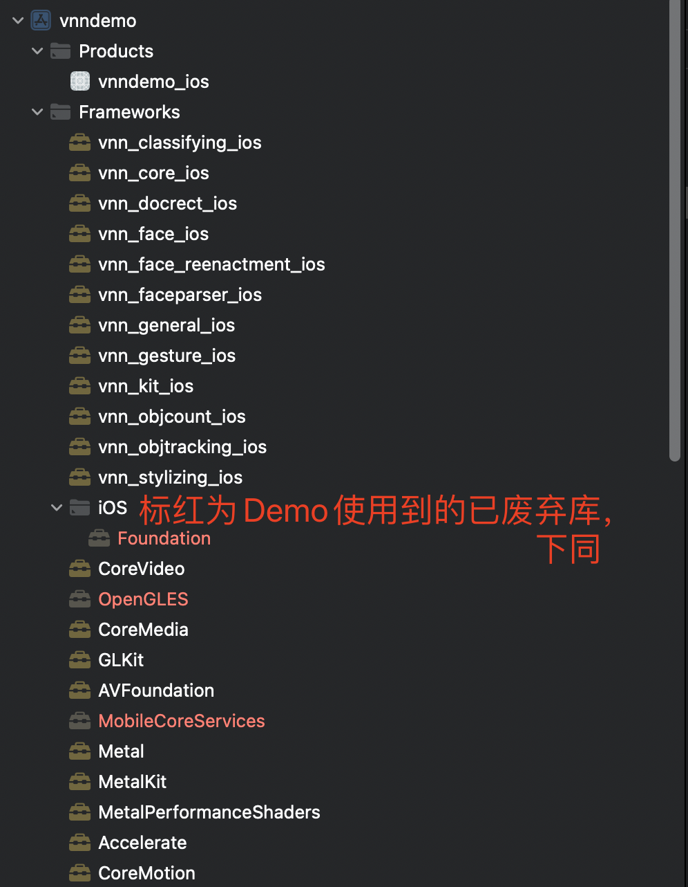
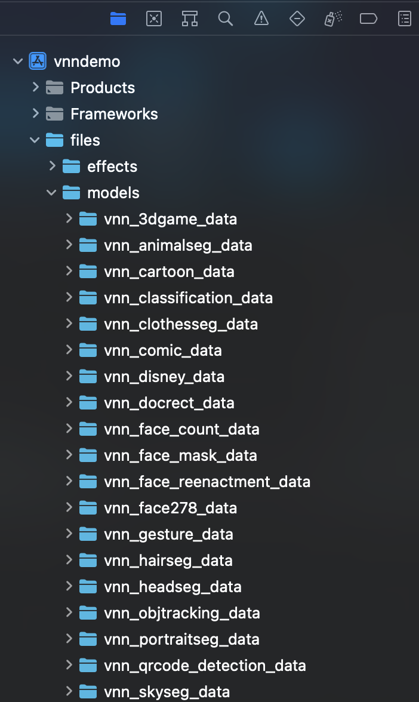
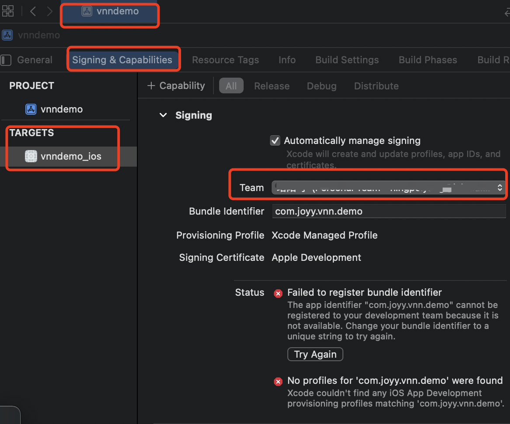
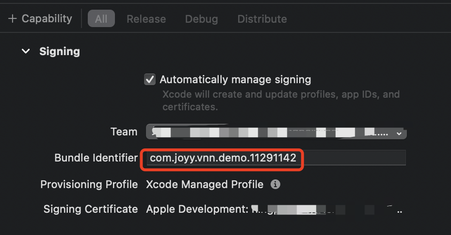
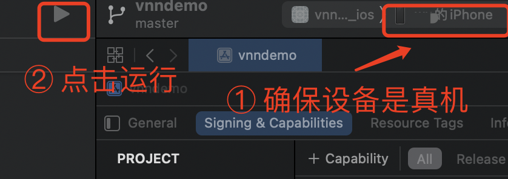
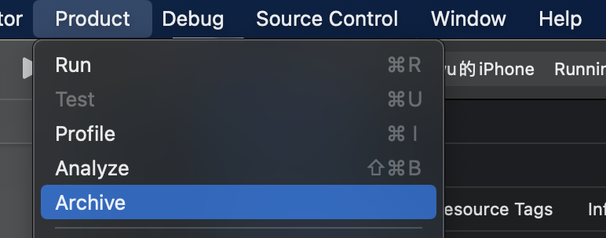
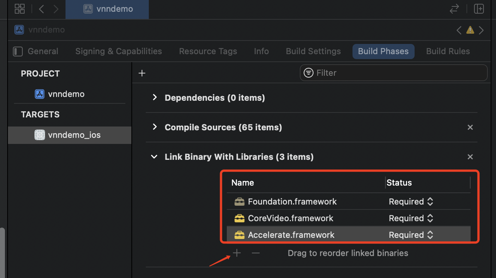
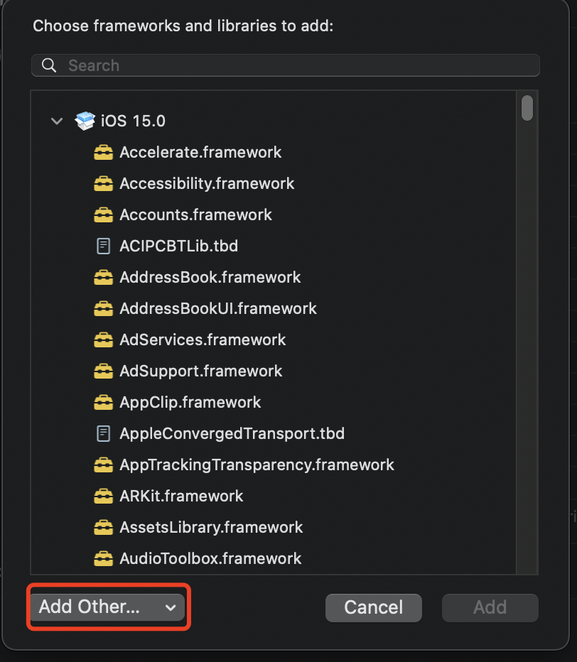
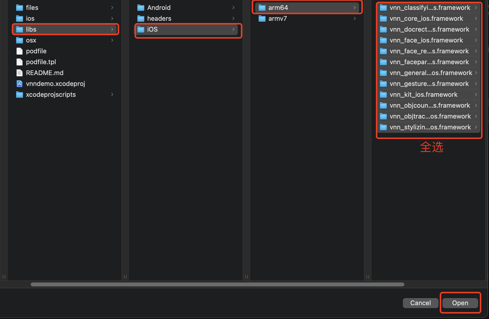
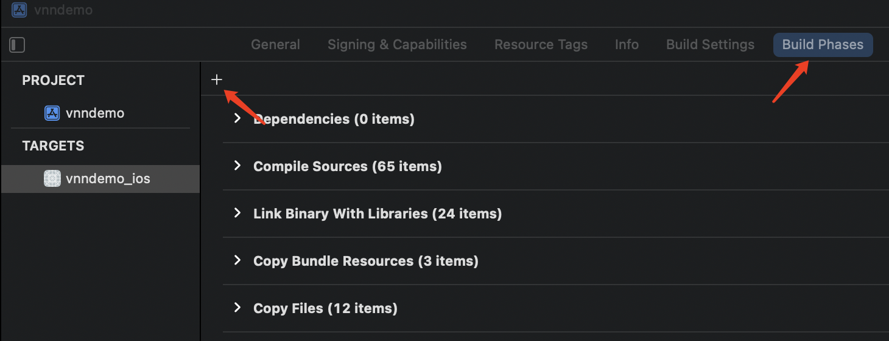

- [1. iOS Demo安装包](#1-ios-demo安装包)
- [2. 运行iOS Demo工程](#2-运行ios-demo工程)
  - [1. 拷贝头文件与库文件](#1-拷贝头文件与库文件)
  - [2. 拷贝模型文件](#2-拷贝模型文件)
  - [3. 检查集成情况](#3-检查集成情况)
  - [4. Demo工程签名](#4-demo工程签名)
  - [5. 接入iPhone真机运行](#5-接入iphone真机运行)
- [3. VNN SDK集成参考](#3-vnn-sdk集成参考)
  - [1. 添加系统库依赖](#1-添加系统库依赖)
  - [2. 添加VNN库](#2-添加vnn库)
  - [3. 添加头文件搜索路径](#3-添加头文件搜索路径)
  - [4. 设置安装时拷贝Framework](#4-设置安装时拷贝framework)
  - [5. 放置模型文件、工程签名、运行等](#5-放置模型文件工程签名运行等)

# 1. iOS Demo安装包
因Apple签名机制的限制，暂不能提供ipa安装包包体验，需要通过Demo工程生成安装包

# 2. 运行iOS Demo工程
iOS Demo工程已提前预设Framework路径、头文件搜索路径等，按如下操作即可运行      
需要准备XCode（指引使用版本为版本为13.1），iPhone（iPhone6及更新）真机   
## 1. 拷贝头文件与库文件
拷贝根目录下的 ```libs``` 文件夹，放入 ```vnn_ios_demos``` 文件夹中  
## 2. 拷贝模型文件
拷贝根目录下的 ```models``` 文件夹中的内容放入 ```vnn_ios_demos/files``` 文件夹中  
## 3. 检查集成情况
用 XCode 打开 vnn_ios_demos 目录下的 ```vnndemo.xcodeproj```文件，如上述步骤正确，XCode将显示 ```Framework``` 集成情况如下   

    

```models``` 集成情况如下   



## 4. Demo工程签名
在 ```“Signing & Capability” ``` 选项卡的  ```“Team” ```  处选择 开发者签名（如无请自行创建创建）      

   

选择签名后，会报  ```“Failed to register bundle indentifier” ``` 的错误，原因是 ```该Bundle Identifier 已被他人占用 ```，修改为其他不冲突名字即可，如下    

   

错误消失后，签名即完成

## 5. 接入iPhone真机运行
因为iOS Demo工程集成的是arm64真机库，所以需要接入iPhone（iPhone6及更新）。点击运行即可运行   

   

点击Archive可生成ipa安装包用于分发测试，这里不展开说明   

   

# 3. VNN SDK集成参考
## 1. 添加系统库依赖
VNN SDK依赖 ```CoreVideo.framework，Foundation.framework, Accelerate.framework ``` 3个系统库，按如下图添加这些依赖库   

   

## 2. 添加VNN库
参考文档页面，根据需要的功能按需添加VNN库的framework。在Demo添加了全部的VNN framework   

   
   


## 3. 添加头文件搜索路径
   

## 4. 设置安装时拷贝Framework
在 ```Build Settings```  选项卡下点击“+”，选择```“New Copy Flies Phase”```   

   

将第2步添加的framework，添加到安装时拷贝的文件列表中   

   

## 5. 放置模型文件、工程签名、运行等
参考上文 ```运行iOS Deom工程```