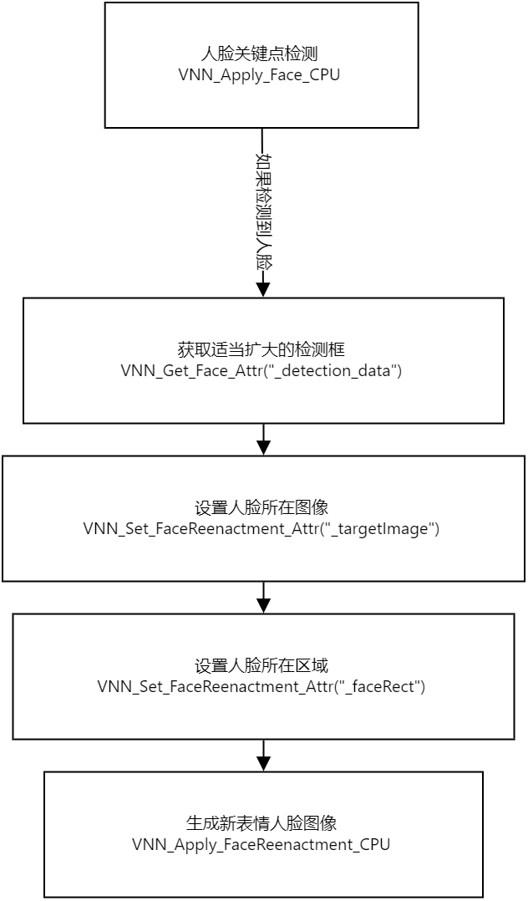

# 人脸表情驱动
- [人脸表情驱动](#人脸表情驱动)
- [一、SDK功能](#一sdk功能)
- [二、技术规格](#二技术规格)
  - [移动端](#移动端)
  - [PC端](#pc端)
- [三、资源依赖](#三资源依赖)
  - [3.1 头文件](#31-头文件)
  - [3.2 模型文件](#32-模型文件)
  - [3.3 动态库](#33-动态库)
- [四、相关说明](#四相关说明)
  - [4.1 处理流程](#41-处理流程)
  - [4.2 Demo示例](#42-demo示例)
- [五、API文档](#五api文档)
  - [5.1 初始化 VNN_Create_FaceReenactment](#51-初始化-vnn_create_facereenactment)
  - [5.2 人脸表情驱动 VNN_Apply_FaceReenactment_CPU](#52-人脸表情驱动-vnn_apply_facereenactment_cpu)
  - [5.3 资源释放 VNN_Destroy_FaceReenactment](#53-资源释放-vnn_destroy_facereenactment)
  - [5.4 设置参数 VNN_Set_FaceReenactment_Attr](#54-设置参数-vnn_set_facereenactment_attr)
  - [5.5 获取参数 VNN_Get_FaceReenactment_Attr](#55-获取参数-vnn_get_facereenactment_attr)
  - [5.6 人脸关键点检测相关API](#56-人脸关键点检测相关api)
- [六、更新记录](#六更新记录)

# 一、SDK功能

给定人脸和表情参数，生成指定表情的人脸   

API的输入、输出对象可参考[VNN 数据结构](./vnn_data_structure.md)   
API的执行情况（是否成功、错误原因等）可参考 ```VNN_Result``` 对应的[状态码表](./status_code.md)

---

# 二、技术规格

## 移动端

| 指标            | 参数                                |
| --------------- | ----------------------------------- |
| 支持图片格式    | BGRA、RGBA、RGB、NV12、NV21、YUV420 |
| 支持架构        | armeabi-v7、arm64-v8a               |
| Android系统版本 | 5.0+                                |
| iOS系统版本     | 9.0+                                |
| 最大支持人脸数  | 1                                   |

## PC端

| 指标            | 参数                                       |
| --------------- | ------------------------------------------ |
| 支持图片格式    | BGRA、RGBA、RGB、YUV420F                   |
| 支持架构        | x86(Win Only)、x86_64、arm64(MacOS Only) |
| Windows系统版本 | Win 7+                                     |
| MacOS系统版本   | 10.10+                                     |
| 最大支持人脸数  | 1                                          |

---

# 三、资源依赖
## 3.1 头文件

```
vnn_face.h
vnn_face_reenactment.h
vnn_kit.h
vnn_define.h
```
## 3.2 模型文件
```
face_reenactment[1.0.0].vnnmodel
driving.kps.json
```
## 3.3 动态库
Android/Linux
```
libvnn_core.so
libvnn_kit.so
libvnn_face.so
libvnn_face_reenactment.so
```
iOS
```
Accelerate.framework
CoreVideo.framework
Foundation.framework
vnn_core_ios.framework
vnn_kit_ios.framework
vnn_face_ios.framework
vnn_face_reenactment_ios.framework
```
MacOS
```
Accelerate.framework
CoreVideo.framework
Cocoa.framework
vnn_core_osx.framework
vnn_kit_osx.framework
vnn_face_osx.framework
vnn_face_reenactment_osx.framework
```
Windows
```
vnn_core.dll
vnn_kit.dll
vnn_face.dll
vnn_face_reenactment.dll
```

---

# 四、相关说明
## 4.1 处理流程   


## 4.2 Demo示例   
Android: [链接](../demos/Android/vnn_android_demo/app/src/main/java/com/duowan/vnndemo/ImageActivity.java)   
iOS: [链接](../demos/iOS/vnn_ios_demo/ios/PictureViewctrls/ViewCtrl_Picture_FaceReenactment.mm)   
Windows: [链接](../demos/Windows/vnn_win_demo/demo/src/vnn_helper.cpp)   
MaoOS: [链接](../demos/MacOS/vnn_macos_demo/osx/PictureWindowCtrls/WindowCtrl_Picture_FaceReenactment.mm)   
Linux: [链接](../demos/Linux/vnn_linux_demo/demo/src/vnn_helper.cpp)   

---
# 五、API文档
## 5.1 初始化 VNN_Create_FaceReenactment
说明: 输入模型路径，完成SDK的初始化，获得用于调用后续功能的Handle
```cpp
VNN_Result VNN_Create_FaceReenactment( VNNHandle * handle, const int argc, const void * argv[] )
```
| 参数   | 含义                                                                                               |
| ------ | -------------------------------------------------------------------------------------------------- |
| handle | 函数调用成功后记录合法的索引，用于调用后续功能，类型为VNN_Handle*，调用成功后handle数值大于0，输出 |
| argc   | 输入模型文件数，类型为const int，输入                                                              |
| argv   | 每个模型文件的具体路径，类型为const char*[ ]，输入                                                 |

返回值: VNN_Result，具体值参见 状态码表  
调用示例:  
``` cpp
VNN_Handle _handle;

std::string model = _modelpath + "/face_reenactment[1.0.0].vnnmodel";

const char* argv[] = {
	model.c_str(),
};

const int argc = sizeof(argv)/sizeof(argv[0]);

VNN_Result ret = VNN_Create_FaceReenactment(&_handle, argc, argv);
```
## 5.2 人脸表情驱动 VNN_Apply_FaceReenactment_CPU
说明: 输入包含人脸的图像，输出检测结果
```cpp
VNN_Result VNN_Apply_FaceReenactment_CPU( VNNHandle handle, const void * input, void * output )
```
| 参数   | 含义                                       |
| ------ | ------------------------------------------ |
| handle | SDK实例索引，类型为 VNN_Handle，输入       |
| input  | 指定表情下标（从1开始），类型为 int*，输入 |
| output | 检测结果，类型为 VNN_Image*，输出          |

返回值: VNN_Result，具体值参见 状态码表  
调用示例:  
``` cpp
#define IMG_CHANNEL (3)
#define IMG_HEIGHT (256)
#define IMG_WIDTH  (256)

// 设置接收生成表情图像的对象
VNN_Image emotionImg;
emotionImg.width = IMG_WIDTH;
emotionImg.height = IMG_HEIGHT;
emotionImg.channels = IMG_CHANNEL;
emotionImg.pix_fmt = VNN_PIX_FMT_RGB888;
if(!_emotionBuf){
    cosnt size_t n_elment = segMaskImg.width * segMaskImg.height * segMaskImg.channels;
    _emotionBuf = (unsigned char *)malloc(n_elment);
}
emotionImg.data = _emotionBuf;

// 获取可用表情个数
int frameCount;
VNN_Get_FaceReenactment_Attr(_handle, "_frameCount", &frameCount);

// 遍历表情生成，注意合法的表情下标从1到frameCount（含）
for(int i=1; i <= frameCount; i++){                
    VNN_Apply_FaceReenactment_CPU(_handle, &i, &emotionImg);
    // 后续处理
}
```

## 5.3 资源释放 VNN_Destroy_FaceReenactment
说明: 不再使用SDK，释放内存等资源
```cpp
VNN_Result VNN_Destroy_FaceReenactment(VNNHandle* handle)
```
| 参数   | 含义                                                                           |
| ------ | ------------------------------------------------------------------------------ |
| handle | SDK实例索引，成功释放资源后将被修改为0（无效值），类型为VNN_Handle*，输入&输出 |

返回值: VNN_Result，具体值参见 状态码表  
调用示例:  
``` cpp
VNN_Result ret = VNN_Destroy_FaceReenactment(&_handle);
// VNN_Result ret = VNN_Destory_Face(&_handle_face); // 如不再使用人脸关键点检测SDK，也一并释放资源
```

## 5.4 设置参数 VNN_Set_FaceReenactment_Attr
说明: 设定SDK实例的运行参数
```cpp
VNN_Result VNN_Set_FaceReenactment_Attr( VNNHandle handle, const char * name, const void * value )
```
| 参数   | 含义                                |
| ------ | ----------------------------------- |
| handle | SDK实例索引，类型为VNN_Handle，输入 |
| name   | 属性名，类型const char*，输入       |
| value  | 属性值，类型参见下表，输入          |

 **合法属性名和属性值**  

 | 属性名       | 属性含义                   | 属性值                                        | 属性值类型  |
 | ------------ | -------------------------- | --------------------------------------------- | ----------- |
 | _kpJsonsPath | 设置表情生成参数文件的路径 | 有效的文件路径字符串                          | const char* |
 | _faceRect    | 用于生成新表情的人脸的坐标 | 人脸关键点检测SDK生成的、有效的VNN_Rect2D对象 | VNN_Rect2D* |
 | _targetImage | 人脸所在图像               | 有效的VNN_Image对象                           | VNN_Image*  |

返回值: VNN_Result，具体值参见 状态码表  
调用示例1:  
``` cpp
// 设置表情生成参数文件的路径

std::string cfg = _modelpath + "/driving.kps.json";
VNN_Set_FaceReenactment_Attr(_handle, "_kpJsonsPath", cfg.c_str());
```

调用示例2:  
``` cpp
// 设置跟踪目标

// input: 视频帧或图像，类型 VNN_Image

// 获取人脸关键点检测结果的同时，获取含相对人脸适当扩大的检测框的检测结果
VNN_FaceFrameDataArr faceArr, detectionArr;
memset(&faceArr, 0x00, sizeof(VNN_FaceFrameDataArr));
memset(&detectionArr, 0x00, sizeof(VNN_FaceFrameDataArr));
VNN_Result ret = VNN_Apply_Face_CPU(_handle_face, &input, &faceArr);
// 注意：在VNN_Apply_Face_CPU之后调用
VNN_Result ret = VNN_Get_Face_Attr(_handle_face, "_detection_data", &detectionArr);

// 设置第1个人脸检测结果作为表情生成的人脸
// 注意：这里的输入数据来自 detectionArr，而不是faceArr
VNN_Set_FaceReenactment_Attr(_handle, "_faceRect", &detectionArr.facesArr[0].faceRect);

// 设置表情人脸所在的完整输入图像
VNN_Set_FaceReenactment_Attr(_handle, "_targetImage", &input);
```

## 5.5 获取参数 VNN_Get_FaceReenactment_Attr
说明: 获取SDK实例的运行参数
```cpp
VNN_Result VNN_Get_FaceReenactment_Attr( VNNHandle handle, const char * name, const void * value )
```
| 参数   | 含义                                |
| ------ | ----------------------------------- |
| handle | SDK实例索引，类型为VNN_Handle，输入 |
| name   | 属性名，类型const char*，输入       |
| value  | 属性值，类型参见下表，输出          |

 **合法属性名和属性值**  

 | 属性名      | 属性含义     | 属性值   | 属性值类型 |
 | ----------- | ------------ | -------- | ---------- |
 | _frameCount | 可用表情个数 | 0,1,2... | int*       |

   
返回值: 类型为VNN_Result，具体值参见 状态码表  
调用示例:  
``` cpp
// 获取可用表情个数
int frameCount;
VNN_Get_FaceReenactment_Attr(_handle, "_frameCount", &frameCount);
```

## 5.6 人脸关键点检测相关API
参考 [链接](./face_landmark_detection.md)

---

# 六、更新记录
| 版本   | 日期       | 更新说明 |
| ------ | ---------- | -------- |
| v1.0.0 | 2021.12.07 | 初次发布 |
