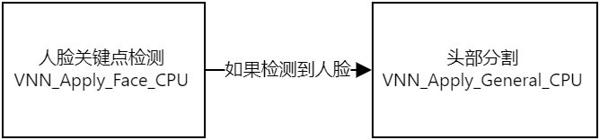

# 头部分割
- [头部分割](#头部分割)
- [一、SDK功能](#一sdk功能)
- [二、技术规格](#二技术规格)
  - [移动端](#移动端)
  - [PC端](#pc端)
- [三、资源依赖](#三资源依赖)
  - [3.1 头文件](#31-头文件)
  - [3.2 模型文件](#32-模型文件)
  - [3.3 动态库](#33-动态库)
- [四、相关说明](#四相关说明)
  - [4.1 处理流程](#41-处理流程)
  - [4.2 Demo示例](#42-demo示例)
- [五、API文档](#五api文档)
  - [5.1 初始化 VNN_Create_General](#51-初始化-vnn_create_general)
  - [5.2 头部分割 VNN_Apply_General_CPU](#52-头部分割-vnn_apply_general_cpu)
  - [5.3 资源释放 VNN_Destroy_General](#53-资源释放-vnn_destroy_general)
  - [5.4 设置参数 VNN_Set_General_Attr](#54-设置参数-vnn_set_general_attr)
  - [5.5 获取参数 VNN_Get_General_Attr](#55-获取参数-vnn_get_general_attr)
  - [5.6 人脸关键点检测相关API](#56-人脸关键点检测相关api)
- [六、更新记录](#六更新记录)

# 一、SDK功能

通过模型生成Mask（遮罩），分离图像或视频中的头部区域与非头部区域。支持同时处理多个头部   

API的输入、输出对象可参考[VNN 数据结构](./vnn_data_structure.md)   
API的执行情况（是否成功、错误原因等）可参考 ```VNN_Result``` 对应的[状态码表](./status_code.md)

---

# 二、技术规格

## 移动端

| 指标            | 参数                                |
| --------------- | ----------------------------------- |
| 支持图片格式    | BGRA、RGBA、RGB、NV12、NV21、YUV420 |
| 支持架构        | armeabi-v7、arm64-v8a               |
| Android系统版本 | 5.0+                                |
| iOS系统版本     | 9.0+                                |
| 最大支持头部数  | 5                                   |

## PC端

| 指标            | 参数                                       |
| --------------- | ------------------------------------------ |
| 支持图片格式    | BGRA、RGBA、RGB、YUV420F                   |
| 支持架构        | x86(Win Only)、x86_64、arm64(MacOS Only) |
| Windows系统版本 | Win 7+                                     |
| MacOS系统版本   | 10.10+                                     |
| 最大支持头部数  | 5                                          |

---

# 三、资源依赖
## 3.1 头文件

```
vnn_face.h
vnn_general.h
vnn_kit.h
vnn_define.h
```
## 3.2 模型文件
```
head_segment[1.0.0].vnnmodel
headseg_v3_process_config.json
```
## 3.3 动态库
Android/Linux
```
libvnn_core.so
libvnn_kit.so
libvnn_face.so
libvnn_general.so

```
iOS
```
Accelerate.framework
CoreVideo.framework
Foundation.framework
vnn_core_ios.framework
vnn_kit_ios.framework
vnn_face_ios.framework
vnn_general_ios.framework
```
MacOS
```
Accelerate.framework
CoreVideo.framework
Cocoa.framework
vnn_core_osx.framework
vnn_kit_osx.framework
vnn_face_osx.framework
vnn_general_osx.framework
```
Windows
```
vnn_core.dll
vnn_kit.dll
vnn_face.dll
vnn_general.dll
```

---

# 四、相关说明
## 4.1 处理流程   



## 4.2 Demo示例   
Android: [链接](../demos/Android/vnn_android_demo/app/src/main/java/com/duowan/vnndemo/CameraActivity.java)   
iOS: [链接](../demos/iOS/vnn_ios_demo/ios/CameraViewctrls/ViewCtrl_Camera_HeadSegment.mm)   
Windows: [链接](../demos/Windows/vnn_win_demo/demo/src/vnn_helper.cpp)   
MaoOS: [链接](../demos/MacOS/vnn_macos_demo/osx/CameraWindowCtrl/WindowCtrl_Camera_HeadSegment.mm)   
Linux: [链接](../demos/Linux/vnn_linux_demo/demo/src/vnn_helper.cpp)   

---
# 五、API文档
## 5.1 初始化 VNN_Create_General
说明: 输入模型路径，完成SDK的初始化，获得用于调用后续功能的Handle
```cpp
VNN_Result VNN_Create_General( VNNHandle * handle, const int argc, const void * argv[] )
```
| 参数   | 含义                                                                                               |
| ------ | -------------------------------------------------------------------------------------------------- |
| handle | 函数调用成功后记录合法的索引，用于调用后续功能，类型为VNN_Handle*，调用成功后handle数值大于0，输出 |
| argc   | 输入模型文件数，类型为const int，输入                                                              |
| argv   | 每个模型文件的具体路径，类型为const char*[ ]，输入                                                 |

返回值: VNN_Result，具体值参见 状态码表  
调用示例:  
``` cpp
VNN_Handle _handle;

std::string model = _modelpath + "/head_segment[1.0.0].vnnmodel";
std::string cfg = _modelpath + "/headseg_v3_process_config.json";

const char* argv[] = {
	model.c_str(),
  cfg.c_str()
};

const int argc = sizeof(argv)/sizeof(argv[0]);

VNN_Result ret = VNN_Create_General(&_handle, argc, argv);
```
## 5.2 头部分割 VNN_Apply_General_CPU
说明: 输入包含人脸的图像，输出检测结果
```cpp
VNN_Result VNN_Apply_General_CPU(VNNHandle handle, const void* in_image, const void* face_data, void* output)
```
| 参数      | 含义                                                         |
| --------- | ------------------------------------------------------------ |
| handle    | SDK实例索引，类型为VNN_Handle，输入                          |
| in_image  | 输入图像，类型为 VNN_Image*，输入                            |
| face_data | 每张人脸的关键点检测信息，类型为 VNN_FaceFrameDataArr*，输入 |
| output    | 检测结果，类型为 VNN_ImageArr*，输出                         |

返回值: VNN_Result，具体值参见 状态码表  
调用示例:  
``` cpp
#define MASK_CHANNEL (1)
#define MASK_HEIGHT (256)
#define MASK_WIDTH  (256)

// input: 视频帧或图像，类型 VNN_Image
// faceArr：人脸关键点检测结果，类型 VNN_FaceFrameDataArr

// 获取对应的Mask
if (!_maskBuffer) {
    // 按最大支持人脸数申请Buffer
    _maskBuffer = (unsigned char *) malloc(MASK_CHANNEL * MASK_HEIGHT * MASK_WIDTH * VN2_FRAMEDATAARR_MAX_FACES_NUM);
}
VNN_ImageArr faceMaskArr;
faceMaskArr.imgsNum = faceArr.facesNum;
// 按实际检测出的人脸数设置输出对象
for (int f = 0; f < faceArr.facesNum; f++) {
    faceMaskDataArr.imgsArr[f].width = MASK_WIDTH; // 输出图像的宽
    faceMaskDataArr.imgsArr[f].height = MASK_HEIGHT; // 输出图像的高
    faceMaskDataArr.imgsArr[f].channels = MASK_CHANNEL; // 输出图像的通道
    faceMaskDataArr.imgsArr[f].pix_fmt = VNN_PIX_FMT_GRAY8; // 输出数值类型为unsigned char
    faceMaskDataArr.imgsArr[f].data = _maskBuffer + f * MASK_CHANNEL * MASK_HEIGHT * MASK_WIDTH;
}
// 头部区域数值255，非头部区域数值0，过渡区域数值0~255
VNN_Apply_General_CPU(_handle, input, face_data, faceMaskArr);
```

## 5.3 资源释放 VNN_Destroy_General
说明: 不再使用SDK，释放内存等资源
```cpp
VNN_Result VNN_Destroy_General(VNNHandle* handle)
```
| 参数   | 含义                                                                           |
| ------ | ------------------------------------------------------------------------------ |
| handle | SDK实例索引，成功释放资源后将被修改为0（无效值），类型为VNN_Handle*，输入&输出 |

返回值: VNN_Result，具体值参见 状态码表  
调用示例:  
``` cpp
VNN_Result ret = VNN_Destroy_General(&_handle);
// VNN_Result ret = VNN_Destory_Face(&_handle_face); // 如不再使用人脸关键点检测SDK，也一并释放资源
```

## 5.4 设置参数 VNN_Set_General_Attr
说明: 设定SDK实例的运行参数
```cpp
VNN_Result VNN_Set_General_Attr( VNNHandle handle, const char * name, const void * value )
```
| 参数   | 含义                                |
| ------ | ----------------------------------- |
| handle | SDK实例索引，类型为VNN_Handle，输入 |
| name   | 属性名，类型const char*，输入       |
| value  | 属性值，类型参见下表，输入          |

 **合法属性名和属性值**  

 | 属性名   | 属性含义 | 属性值 | 属性值类型 |
 | -------- | -------- | ------ | ---------- |
 | 暂时为空 |
   
返回值: VNN_Result，具体值参见 状态码表  
调用示例:  
``` cpp
// 暂时为空
```

## 5.5 获取参数 VNN_Get_General_Attr
说明: 获取SDK实例的运行参数
```cpp
VNN_Result VNN_Get_General_Attr( VNNHandle handle, const char * name, const void * value )
```
| 参数   | 含义                                |
| ------ | ----------------------------------- |
| handle | SDK实例索引，类型为VNN_Handle，输入 |
| name   | 属性名，类型const char*，输入       |
| value  | 属性值，类型参见下表，输出          |

 **合法属性名和属性值**  

 | 属性名   | 属性含义 | 属性值 | 属性值类型 |
 | -------- | -------- | ------ | ---------- |
 | 暂时为空 |
   
返回值: 类型为VNN_Result，具体值参见 状态码表  
调用示例:  
``` cpp
// 暂时为空
```

## 5.6 人脸关键点检测相关API
参考 [链接](./face_landmark_detection.md)

---

# 六、更新记录
| 版本   | 日期       | 更新说明 |
| ------ | ---------- | -------- |
| v1.0.0 | 2021.12.07 | 初次发布 |
