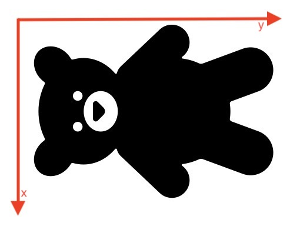
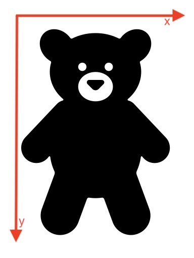

# C/C++ 结构体 VNN_Image 的使用说明

- [C/C++ 结构体 VNN_Image 的使用说明](#cc-结构体-vnn_image-的使用说明)
  - [概述](#概述)
  - [朝向描述 ori_fmt 及其类型 VNN_ORIENT_FMT](#朝向描述-ori_fmt-及其类型-vnn_orient_fmt)
  - [图像格式的描述 pix_fmt 及其类型 VNN_PIX_FMT](#图像格式的描述-pix_fmt-及其类型-vnn_pix_fmt)
  - [调用模式的描述 mode_fmt 及其类型 VNN_MODE_FMT](#调用模式的描述-mode_fmt-及其类型-vnn_mode_fmt)
  - [输入图像的 CPU 数据指针 data](#输入图像的-cpu-数据指针-data)
  - [输入图像的 GPU 数据指针 texture](#输入图像的-gpu-数据指针-texture)
  - [Android 示例：利用传入JNI接口的Bitmap对象，设置VNN_Image对象](#android-示例利用传入jni接口的bitmap对象设置vnn_image对象)
  - [iOS/MacOS 示例：利用CVPixelBufferRef对象，设置VNN_Image对象](#iosmacos-示例利用cvpixelbufferref对象设置vnn_image对象)

## 概述
VNN_Image 结构体是由用户生成，用于描述VNN的输入图像数据。```用户必须正确设置输入的图像数据，以防出现奇怪的Bug```   
VNN_Image的属性如下：

        typedef struct _VNN_Image {
            VNN_ORIENT_FMT   ori_fmt;	 /* orientation format enum of img*/
            VNN_PIX_FMT      pix_fmt;    /* pixel format enum of img */
            VNN_MODE_FMT	 mode_fmt;	 /* mode format enum of detection, can use video/picture/default */
            VNNInt32         width;      /* width of img */
            VNNInt32         height;     /* height of img */
            VNNInt32         channels;   /* channels of img */
            VNNVoidPtr       data;       /* if is cpu-backend, data means the raw data of img, default type is "unsigned char". But data is NULL in gpu-backend. */
            VNNVoidPtr       texture;    /* if is cpu-backend, texture is NULL. But if is gpu-backend, texture may be a VNN_Texture(android|ios) or a CVPixelbuffer(ios). */
        } VNN_Image;
- 输入朝向的描述 ori_fmt：用于指示如何旋转输入的图像信息。例如，对于人脸检测，就是描述当前的图像如何旋转和翻转，才能把人”扶正“
- 输入图像格式的描述 pix_fmt：描述输入的图像格式，例如BGRA8888，YUV等
- 输入调用模式的描述 mode_fmt：用于声明，输入图像是用于单帧检测，还是视频流检测
- 输入图像通道数、高、宽的描述 channels/height/width：用于描述输入图像的大小
- 输入图像的 CPU 数据 data：这个是个裸指针，如果API调用CPU进行计算处理，输入的图像Buffer指针必须不为空
- 输入图像的 GPU 数据 texture: 如果API调用GPU进行计算处理，此指针必定不能为空

---

## 朝向描述 ori_fmt 及其类型 VNN_ORIENT_FMT

朝向格式的结构体描述如下：

        typedef enum _VNN_ORIENT_FMT {
            /*
            Like value as VNN_ORIENT_FMT_ROTATE_90L|VNN_ORIENT_FMT_FLIP_V, means fristly anticlockwise rotate 90 degree, and then flip vertically;
            So, the priority rotation is higher then flip.
            */
            VNN_ORIENT_FMT_DEFAULT =     0x00000000, /*  Unknow orientated format, as a default option, no rotate and no flip */
            VNN_ORIENT_FMT_ROTATE_90L =  0x00000001, /*  anticlockwise rotate 90 degree (clockwise rotate 270 degree)  */
            VNN_ORIENT_FMT_ROTATE_90R =  0x00000002, /*  clockwise rotate 90 degree  */
            VNN_ORIENT_FMT_ROTATE_180 =  0x00000004, /*  rotate 180 degree  */
            VNN_ORIENT_FMT_FLIP_V =      0x00000008, /*  flip vertically */
            VNN_ORIENT_FMT_FLIP_H =      0x00000010, /*  flip horizontally */
            VNN_ORIENT_FMT_ROTATE_360 =  0x00000020, /*  android case: post carma orientation = 270 degree */
            VNN_ORIENT_FMT_ROTATE_180L = 0x00000040, /*  android case: post carma orientation = 270 degree */
            VNN_ORIENT_FMT_ERROR =       0xFFFFFFFF, /*  ERROR */
        } VNN_ORIENT_FMT;

朝向格式描述主要分为两种：```旋转```和```翻转```。

这里的旋转，都指代```顺时针```。

朝向描述可以通过组合旋转和翻转两种枚举（通过或“|”运算）来达到所有需要的输入方向。如果通过或运算得到的朝向描述，优先级是：```先旋转，再翻转```

**例子**

对于人脸识别，如果相机采集的图像是这样的：



我需要把这个图像顺时针转90°，然后绕着垂直中轴线翻转（水平翻转）一下，图像才算是正向（注意图像坐标轴方向）的：



如图所示，那么代码应该是：

    VNN_Image img;
    img.ori_fmt = VNN_ORIENT_FMT_ROTATE_90R | VNN_ORIENT_FMT_FLIP_H;

```由于相机采集的多样性，加之重力感应等因素的影响，使用者需要每时每刻都准确知道自己输入图像的物理数据的坐标轴方向，并准确地设置好 VNN_Image 结构体的朝向描述 ori_fmt，以避免出现无法预知的奇怪问题。```

---

## 图像格式的描述 pix_fmt 及其类型 VNN_PIX_FMT

VNN_PIX_FMT 枚举类型如下

        typedef enum _VNN_PIX_FMT {
            VNN_PIX_FMT_UNKNOW,      /*  Unknow pixel format, as a cube */
            VNN_PIX_FMT_YUVI420,     /*  YUV  4:2:0   12bpp ( 3 planes, the first is Y, the second is U, the third is V */
            VNN_PIX_FMT_YUV420F,     /*  YUV  4:2:0   12bpp ( 2 planes, ios FullRange, the first is Y - luminance channel, the other channel was UV alternate permutation.) */
            VNN_PIX_FMT_YUV420V,     /*  YUV  4:2:0   12bpp ( 2 planes, ios VideoRange, the first is Y - luminance channel, the other channel was UV alternate permutation.) */
            VNN_PIX_FMT_YUV420P_888_SKIP1, /*  YUV  4:2:0   12bpp ( 3 planes, android Camera2, the first is Y - luminance channel, the second is U channel with skip 1, the third is V channel with skip 1.) */
            VNN_PIX_FMT_BGRA8888,    /*  BGRA 8:8:8:8 32bpp ( 4 channel, 8x4=32bit BGRA pixel ) */
            VNN_PIX_FMT_RGBA8888,    /*  RGBA 8:8:8:8 32bpp ( 4 channel, 8x4=32bit RGBA pixel ) */
            VNN_PIX_FMT_GRAY8,       /*  Y    1        8bpp ( 1 channel, 8bit luminance pixel ) */
            VNN_PIX_FMT_NV12,        /*  YUV  4:2:0   12bpp ( 2 planes, the first is Y - luminance channel, the other channel was UV alternate permutation ) */
            VNN_PIX_FMT_NV21,        /*  YUV  4:2:0   12bpp ( 2 planes, andoird default, the first is Y - luminance channel, the other channel was VU alternate permutation ) */
            VNN_PIX_FMT_BGR888,      /*  BGR  8:8:8   24bpp ( 3 channel, 8x3=24bit BGR pixel ) */
            VNN_PIX_FMT_RGB888,      /*  RGB  8:8:8   24bpp ( 3 channel, 8x3=24bit RGB pixel ) */
            VNN_PIX_FMT_GRAY32,      /*  Y    1        8bpp ( 1 channel, 32bit float luminance pixel ) */
            VNN_PIX_FMT_CHW_U8,      /*  As a cube , data layerout was chw, data type was unsigned char */
            VNN_PIX_FMT_CHW_F32,     /*  As a cube , data layerout was chw, data type was float 32 */
            VNN_PIX_FMT_ERROR        /*  Error pixel format */
        } VNN_PIX_FMT;

- VNN_PIX_FMT_YUVI420：一般出现在PC端相机数据。数据为 Y-Plane，U-Plane，V-Plane 三个。
- VNN_PIX_FMT_YUV420F：对应 iOS/macOS 相机采集的格式 kCVPixelFormatType_420YpCbCr8BiPlanarFullRange
- VNN_PIX_FMT_YUV420V：对应 iOS/macOS 相机采集的格式 kCVPixelFormatType_420YpCbCr8BiPlanarVideoRange
- VNN_PIX_FMT_YUV420P_888_SKIP1：一般出现在安卓端相机数据。数据为 Y-Plane，U-Plane，V-Plane 三个
- VNN_PIX_FMT_BGRA8888：8bit BGRA 图像格式，跟 OpenCV 的 8bit BGRA 图像一样
- VNN_PIX_FMT_RGBA8888：8bit RGBA 图像格式，跟 OpenCV 的 8bit RGBA 图像一样
- VNN_PIX_FMT_GRAY8：8bit 灰度图，跟 OpenCV 的 8bit 灰度图像一样
- VNN_PIX_FMT_NV12：一般出现在安卓端相机数据。数据为 Y-Plane 和 UV-Plane
- VNN_PIX_FMT_NV21：一般出现在安卓端相机数据。数据为 Y-Plane 和 VU-Plane
- VNN_PIX_FMT_BGR888：8bit BGR 图像格式，跟 OpenCV 的 8bit BGR 图像一样
- VNN_PIX_FMT_RGB888：8bit RGB 图像格式，跟 OpenCV 的 8bit RGB 图像一样
- VNN_PIX_FMT_GRAY32：32bit 浮点型灰度图
- VNN_PIX_FMT_CHW_U8：CHW 排布的 8bit 无符号整形数据块
- VNN_PIX_FMT_CHW_F32：CHW 排布的 8bit 无符号整形数据块
  
```目前VNN支持的输入图像格式包括：VNN_PIX_FMT_YUVI420、VNN_PIX_FMT_YUV420V、VNN_PIX_FMT_YUV420P_888_SKIP1、VNN_PIX_FMT_BGRA8888、VNN_PIX_FMT_RGBA8888、VNN_PIX_FMT_NV12、VNN_PIX_FMT_NV21、VNN_PIX_FMT_RGB888```

---

## 调用模式的描述 mode_fmt 及其类型 VNN_MODE_FMT
VNN_MODE_FMT 枚举类型如下

    typedef enum _VNN_MODE_FMT {
        VNN_MODE_FMT_VIDEO = 0x00000000,
        VNN_MODE_FMT_PICTURE = 0x00000001,
        VNN_MODE_FMT_DEFAULT = 0x00000000,
    } VNN_MODE_FMT;

出于保证视频流应用的实时性考虑，部分SDK采用了“跳帧”、“跟踪”等优化设计。为避免单张、静态图像应用受此影响：   
- 对于静态图像的应用，需要把 mode_fmt 设置为 ```VNN_MODE_FMT_PICTURE```   
- 对于视频流的应用，需要把 mode_fmt 设置为 ```VNN_MODE_FMT_VIDEO```

---
  

## 输入图像的 CPU 数据指针 data
调用CPU进行计算处理，需要将data指针指向图像(Bitmap, CVPixelBufferRef等)的Buffer首地址，数据类型为Byte(unsigned char)

---

## 输入图像的 GPU 数据指针 texture 

因GPU接口未开放，指针暂时固定指向空

---

## Android 示例：利用传入JNI接口的Bitmap对象，设置VNN_Image对象   

**设置**
```cpp
    // bitmap：通过JNI接口传入的Bitmap对象

    AndroidBitmapInfo info;
    AndroidBitmap_getInfo(env, bitmap, &info);

    VNN_Image input;
    // 设置VNN_Image对象的data指针
    // 指向Bitmap对象的Buffer首地址
    AndroidBitmap_lockPixels(env, bitmap, input.data);

    // 设置其他的成员
    input.width = info.width; // 设置宽
    input.height = info.height; // 设置高
    if(info.format == ANDROID_BITMAP_FORMAT_RGBA_8888){ // 设置图像格式
        input.pix_fmt = VNN_PIX_FMT_RGBA8888;
        input.channel = 4;
    }
    else{
        // 其他图像格式的设置
    }
    
    input.ori_fmt = VNN_ORIENT_FMT_DEFAULT; // 设置图像方向（根据实际情况设置）
    input.mode_fmt = VNN_MODE_FMT_DEFAULT; // 设置调用模式（根据实际情况设置）
    input.texture = nullptr; // 暂未开放GPU接口，固定为空
```
**释放**
```cpp
    // bitmap：通过JNI接口传入的Bitmap对象
    // input: 使用完毕后的VNN_Image对象

    input.data = nullptr;
    // 使用完毕后释放对bitmap的引用
    AndroidBitmap_unlockPixels(env, bitmap);
```

--- 

## iOS/MacOS 示例：利用CVPixelBufferRef对象，设置VNN_Image对象   

参考代码如下   
**注意**：VNN_Image对象的 ```ori_fmt``` 和 ```mode_fmt```属性仍需用户按实际情况设置    

**设置**
```cpp
    // __pixelbuffer: 有效的CVPixelBufferRef
    // __vnnimage：指向有效的VNN_Image对象的指针

    CVPixelBufferRef inputPixBuffer = (CVPixelBufferRef)__pixelbuffer;
    CVPixelBufferLockBaseAddress(inputPixBuffer, kCVPixelBufferLock_ReadOnly);
    VNN_Image *image =(VNN_Image *)__vnnimage;
	memset(image, 0x00, sizeof(VNN_Image));
    image->texture = inputPixBuffer;
	if (CVPixelBufferGetPlaneCount(inputPixBuffer) == 0) {
		size_t iHeight = (int)CVPixelBufferGetHeight(inputPixBuffer);
		size_t iWidth = (int)CVPixelBufferGetWidth(inputPixBuffer);
		size_t bytesPerRow = CVPixelBufferGetBytesPerRow(inputPixBuffer);
		uint8_t *baseAddress = (uint8_t*)CVPixelBufferGetBaseAddress(inputPixBuffer);
		image->width = (int)iWidth;
		image->height = (int)iHeight;
		image->channels = 4;
		image->pix_fmt = VNN_PIX_FMT_BGRA8888;
		if (bytesPerRow != iWidth * 4) {
            while (!VNVideoBufferLocker.try_lock()) { continue; }
            size_t current_bytes = iHeight * iWidth * 4;
            if (VNVideoBuffer._buffer == NULL) {
                VNVideoBuffer._bytes = current_bytes;
                VNVideoBuffer._buffer = (uint8_t *)malloc(current_bytes);
            }
            else {
                if (VNVideoBuffer._bytes < current_bytes) {
                    free(VNVideoBuffer._buffer);
                    VNVideoBuffer._bytes = current_bytes;
                    VNVideoBuffer._buffer = (uint8_t *)malloc(current_bytes);
                }
            }
			unsigned char *ptr_indata = VNVideoBuffer._buffer;
			unsigned char *ptr_indata_temp = ptr_indata;
			unsigned char *ptr_pixbuf_temp = baseAddress;
			for (int r = 0; r < iHeight; r++) {
				memcpy(ptr_indata_temp, ptr_pixbuf_temp, iWidth * 4);
				ptr_indata_temp += iWidth * 4;
				ptr_pixbuf_temp += bytesPerRow;
			}
			image->data = ptr_indata;
            VNVideoBufferLocker.unlock();
		} else {
			image->data = baseAddress;
		}
	}
	else {
		size_t iHeight = (int)CVPixelBufferGetHeight(inputPixBuffer);
		size_t iWidth = (int)CVPixelBufferGetWidth(inputPixBuffer);
		size_t bytePerRowPlane0 = CVPixelBufferGetBytesPerRowOfPlane(inputPixBuffer, 0);
		size_t bytePerRowPlane1 = CVPixelBufferGetBytesPerRowOfPlane(inputPixBuffer, 1);
		uint8_t *baseAddress = (uint8_t*)CVPixelBufferGetBaseAddress(inputPixBuffer);
		uint8_t *baseAddress_plane0 = (uint8_t*)CVPixelBufferGetBaseAddressOfPlane(inputPixBuffer, 0);
		uint8_t *baseAddress_plane1 = (uint8_t*)CVPixelBufferGetBaseAddressOfPlane(inputPixBuffer, 1);
		image->width    = (int)iWidth;
		image->height   = (int)iHeight;
		image->channels = 0;
		switch (CVPixelBufferGetPixelFormatType(inputPixBuffer)) {
			case kCVPixelFormatType_420YpCbCr8BiPlanarFullRange:
				image->pix_fmt  = VNN_PIX_FMT_YUV420F;
				break;
			case kCVPixelFormatType_420YpCbCr8BiPlanarVideoRange:
				image->pix_fmt  = VNN_PIX_FMT_YUV420V;
				break;
			default:
				VN_ASSERT(false);
				break;
		}
        if (i_gpu_only) {
            return;
        }
		if (iWidth != bytePerRowPlane0 || iWidth != bytePerRowPlane1 || baseAddress != baseAddress_plane0 || baseAddress + iHeight * iWidth != baseAddress_plane1) {
            while (!VNVideoBufferLocker.try_lock()) { continue; }
            size_t current_bytes = iHeight * iWidth + ((iHeight * iWidth) >> 1);
            if (VNVideoBuffer._buffer == NULL) {
                VNVideoBuffer._bytes = current_bytes;
                VNVideoBuffer._buffer = (uint8_t *)malloc(current_bytes);
            }
            else {
                if (VNVideoBuffer._bytes < current_bytes) {
                    free(VNVideoBuffer._buffer);
                    VNVideoBuffer._bytes = current_bytes;
                    VNVideoBuffer._buffer = (uint8_t *)malloc(current_bytes);
                }
            }
            unsigned char *ptr_indata = VNVideoBuffer._buffer;
			{
				unsigned char *ptr_indata_temp = ptr_indata;
				unsigned char *ptr_pixdata_temp0 = (unsigned char *)CVPixelBufferGetBaseAddressOfPlane(inputPixBuffer, 0);
				for (int r = 0; r < iHeight; r++) {
					memcpy(ptr_indata_temp, ptr_pixdata_temp0, iWidth);
					ptr_indata_temp += iWidth;
					ptr_pixdata_temp0 += bytePerRowPlane0;
				}
			}
			{
				unsigned char *ptr_indata_temp = ptr_indata + iWidth * iHeight;
				unsigned char *ptr_pixdata_temp1 = (unsigned char *)CVPixelBufferGetBaseAddressOfPlane(inputPixBuffer, 1);
				for (int r = 0; r < iHeight / 2; r++) {
					memcpy(ptr_indata_temp, ptr_pixdata_temp1, iWidth);
					ptr_indata_temp += iWidth;
					ptr_pixdata_temp1 += bytePerRowPlane1;
				}
			}
			image->data = ptr_indata;
            VNVideoBufferLocker.unlock();
		}
		else {
			image->data = baseAddress;
		}
	}
```
**释放**
```cpp
    // __pixelbuffer: 有效的CVPixelBufferRef
    // __vnnimage：指向有效的VNN_Image对象的指针

    VNN_Image *image =(VNN_Image *)__vnnimage;
    image->data = nullptr;

    CVPixelBufferRef inputPixBuffer = (CVPixelBufferRef)__pixelbuffer;
    CVPixelBufferUnlockBaseAddress(inputPixBuffer, kCVPixelBufferLock_ReadOnly);
```